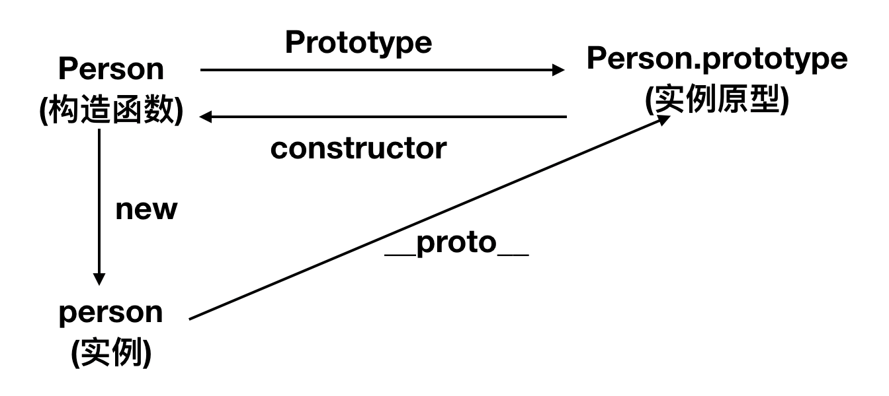

## 构造函数创建对象
使用构造函数创建一个对象
```javascript
  function Person () {};
  var person = new Person();
  person.name = 'ben';
  console.log(person.name) // ben
```
Person就是一个构造函数,我们使用了new创建了一个实例对象person

## prototype
每个函数都有一个prototype属性
```javascript
  function Person(){};
  Person.prototype.name = 'ben';
  var person1 = new Person();
  var person2 = new Person();
  console.log(person1.name); // ben
  console.log(person2.name) // ben
```
函数的prototype属性指向哪里呢?  

函数的prototype指向的是一个对象,该对象是由构造函数创建出来的实例的原型,也就是person1和person2的原型

什么是原型? 每个JavaScript对象在创建时就会与之关联另一个对象,这个对象就是我们所说的原型,每一个对象都会从原型中继承属性和方法.  

用图来表示构造函数和原型之间的关系  



在这张图中,我们用Object.prototype表示实例原型  
那么实例和实例原型之间的关系用什么来表示呢,需要讲到第二个属性:
### __proto__
每个js对象都具有的属性,用来指向该对象的原型
```JavaScript
function Person(){}
var person = new Person();
person.__proto__ === Person.prototype // true
```

既然构造函数和实例都可以指向原型,那么原型是否可以指向构造函数或实例呢?
### constructor
原型指向不了实例,因为实例太多,但可以指向构造函数,这是要讲到的第三个属性,每个原型都有一个constructor属性指向关联的构造函数.
```JavaScript
function Person(){}
Person === Person.prototype.constructor // true
```
新的关系


### 实例与原型
当读取实例的原型时,如果找不到,就会去找与对象关联的原型中的属性,如果找不到就会去找原型的原型,一直找到顶层为止.
```JavaScript
function Person(){}
Person.prototype.name = 'zhangsan'
var person = new Person()
person.name = 'lisi
console.log(person.name) // lisi
delete person.name
console.log(person.name) // zhangsan
```
在这个例子中,我们给实例person添加了一个name属性,输出了lisi,然后删除了person.name属性,person实例找不到name属性,因此会从person.__proto__,即Person.prototype中查找到name,输出zhangsan.  
如果实例的原型找不到呢?原型的原型又是什么?
### 原型的原型
之前说过,原型也是一个对象,我们就可以通过原始方法创建他
```javascript
var obj = new Object()
obj.name = 'zhangsan'
console.log(obj.name) // zhangsan 
```
原型对象就是通过Object构造函数创建的,结合之前说的,实例的__proto__指向构造函数的prototype


### 原型链
Object.prototype的原型呢?
```JavaScript
Object.prototype.__proto__ === null
```
然而null代表什么?
阮一峰老师说的:  
null 表示'没有对象',即该处不应该有值  
所以Object.prototype.__proto__的值为null 和 Object.prototype 没有原型,表达的是一个意思
所以最上层就是null
