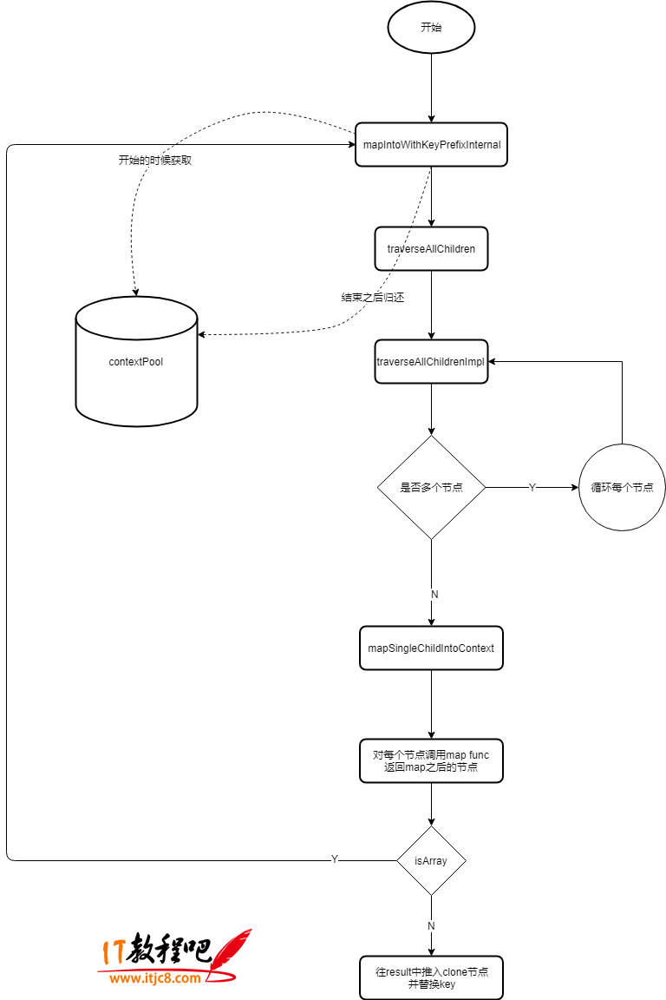

## 用法

```js
import React from 'react';

function ChildrenDemo(props) {
  console.log(props.children);
  // [child1,1,1,2,2]
  console.log(React.Children.map(props.children, c => [c, [c, c]]));
  return props.children;
}

export default () => (
  <ChildrenDemo>
    <span>1</span>
    <span>2</span>
  </ChildrenDemo>
);
```

## 源码

ReactChildren.js

```js
// 方法
const Children = {
  map: mapChildren,
  forEach,
  count,
  toArray,
  only
};

function mapChildren(children, func, context) {
  if (children == null) {
    return children;
  }
  const result = [];
  mapIntoWithKeyPrefixInternal(children, result, null, func, context);
  return result;
}

function mapIntoWithKeyPrefixInternal(children, array, prefix, func, context) {
  let escapedPrefix = '';
  if (prefix != null) {
    escapedPrefix = escapeUserProvidedKey(prefix) + '/';
  }
  const traverseContext = getPooledTraverseContext(
    array,
    escapedPrefix,
    func,
    context
  );
  traverseAllChildren(children, mapSingleChildIntoContext, traverseContext);
  releaseTraverseContext(traverseContext);
}

const POOL_SIZE = 10;
const traverseContextPool = [];
function getPooledTraverseContext(
  mapResult,
  keyPrefix,
  mapFunction,
  mapContext
) {
  if (traverseContextPool.length) {
    // 声明对象和删除对象,会导致内存抖动
    const traverseContext = traverseContextPool.pop();
    traverseContext.result = mapResult;
    traverseContext.keyPrefix = keyPrefix;
    traverseContext.func = mapFunction;
    traverseContext.context = mapContext;
    traverseContext.count = 0;
    return traverseContext;
  } else {
    // 最后又删除了pool
    return {
      result: mapResult,
      keyPrefix: keyPrefix,
      func: mapFunction,
      context: mapContext,
      count: 0
    };
  }
}

function releaseTraverseContext(traverseContext) {
  traverseContext.result = null;
  traverseContext.keyPrefix = null;
  traverseContext.func = null;
  traverseContext.context = null;
  traverseContext.count = 0;
  if (traverseContextPool.length < POOL_SIZE) {
    traverseContextPool.push(traverseContext);
  }
}

/**
 * @param {?*} children Children tree container.
 * @param {!string} nameSoFar Name of the key path so far.
 * @param {!function} callback Callback to invoke with each child found.
 * @param {?*} traverseContext Used to pass information throughout the traversal
 * process.
 * @return {!number} The number of children in this subtree.
 */
function traverseAllChildrenImpl(
  children,
  nameSoFar,
  callback,
  traverseContext
) {
  const type = typeof children;

  if (type === 'undefined' || type === 'boolean') {
    // All of the above are perceived as null.
    children = null;
  }

  let invokeCallback = false;

  if (children === null) {
    invokeCallback = true;
  } else {
    switch (type) {
      case 'string':
      case 'number':
        invokeCallback = true;
        break;
      case 'object':
        switch (children.$$typeof) {
          case REACT_ELEMENT_TYPE:
          case REACT_PORTAL_TYPE:
            invokeCallback = true;
        }
    }
  }

  if (invokeCallback) {
    callback(
      traverseContext,
      children,
      // If it's the only child, treat the name as if it was wrapped in an array
      // so that it's consistent if the number of children grows.
      nameSoFar === '' ? SEPARATOR + getComponentKey(children, 0) : nameSoFar
    );
    return 1;
  }

  let child;
  let nextName;
  let subtreeCount = 0; // Count of children found in the current subtree.
  const nextNamePrefix =
    nameSoFar === '' ? SEPARATOR : nameSoFar + SUBSEPARATOR;

  if (Array.isArray(children)) {
    for (let i = 0; i < children.length; i++) {
      child = children[i];
      nextName = nextNamePrefix + getComponentKey(child, i);
      subtreeCount += traverseAllChildrenImpl(
        child,
        nextName,
        callback,
        traverseContext
      );
    }
  } else {
    const iteratorFn = getIteratorFn(children);
    if (typeof iteratorFn === 'function') {
      if (__DEV__) {
        // Warn about using Maps as children
        if (iteratorFn === children.entries) {
          warning(
            didWarnAboutMaps,
            'Using Maps as children is unsupported and will likely yield ' +
              'unexpected results. Convert it to a sequence/iterable of keyed ' +
              'ReactElements instead.'
          );
          didWarnAboutMaps = true;
        }
      }

      const iterator = iteratorFn.call(children);
      let step;
      let ii = 0;
      while (!(step = iterator.next()).done) {
        child = step.value;
        nextName = nextNamePrefix + getComponentKey(child, ii++);
        subtreeCount += traverseAllChildrenImpl(
          child,
          nextName,
          callback,
          traverseContext
        );
      }
    } else if (type === 'object') {
      let addendum = '';
      if (__DEV__) {
        addendum =
          ' If you meant to render a collection of children, use an array ' +
          'instead.' +
          ReactDebugCurrentFrame.getStackAddendum();
      }
      const childrenString = '' + children;
      invariant(
        false,
        'Objects are not valid as a React child (found: %s).%s',
        childrenString === '[object Object]'
          ? 'object with keys {' + Object.keys(children).join(', ') + '}'
          : childrenString,
        addendum
      );
    }
  }

  return subtreeCount;
}
```


