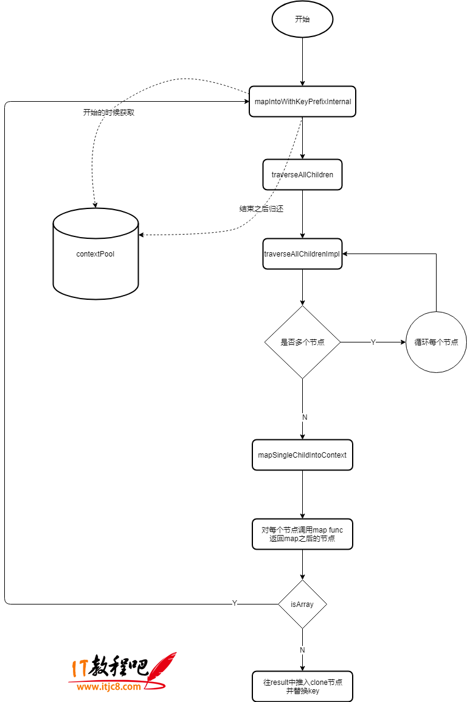

## 用法

```js
import React from 'react';

function ChildrenDemo(props) {
  console.log(props.children);
  // [child1,1,1,2,2]
  console.log(React.Children.map(props.children, c => [c, [c, c]]));
  return props.children;
}

export default () => (
  <ChildrenDemo>
    <span>1</span>
    <span>2</span>
  </ChildrenDemo>
);
```

## 源码

ReactChildren.js

```js
// 方法
const Children = {
  map: mapChildren,
  forEach,
  count,
  toArray,
  only
};

function mapChildren(children, func, context) {
  if (children == null) {
    return children;
  }
  const result = [];
  mapIntoWithKeyPrefixInternal(children, result, null, func, context);
  return result;
}

function mapIntoWithKeyPrefixInternal(children, array, prefix, func, context) {
  let escapedPrefix = '';
  if (prefix != null) {
    escapedPrefix = escapeUserProvidedKey(prefix) + '/';
  }
  const traverseContext = getPooledTraverseContext(
    array,
    escapedPrefix,
    func,
    context
  );
  traverseAllChildren(children, mapSingleChildIntoContext, traverseContext);
  releaseTraverseContext(traverseContext);
}
```


